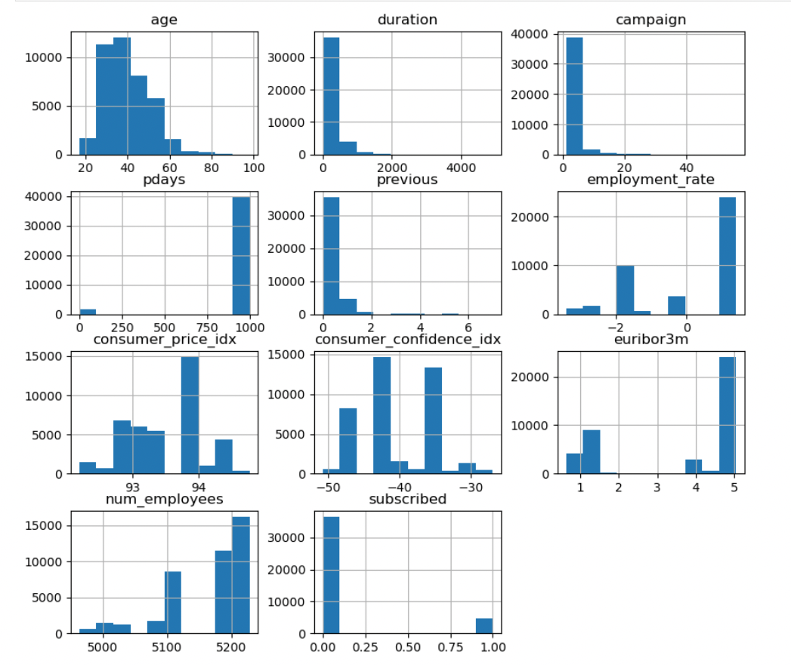
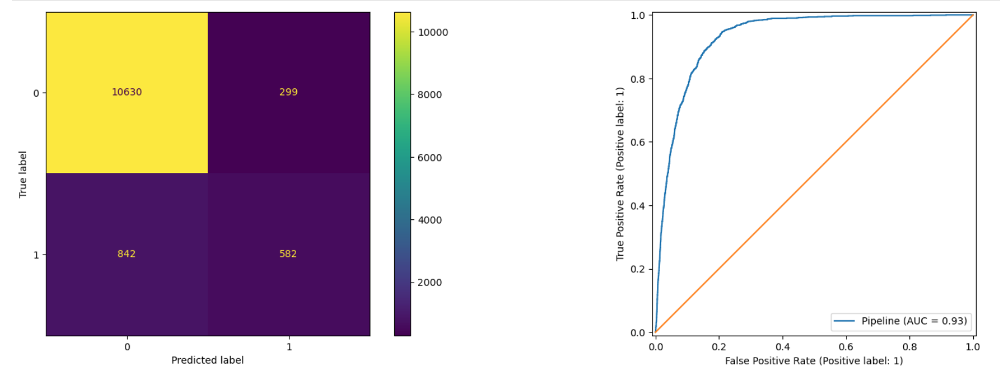
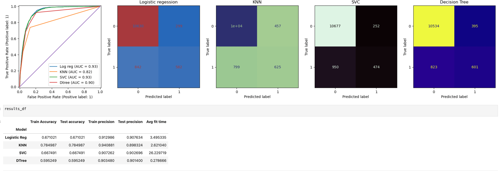
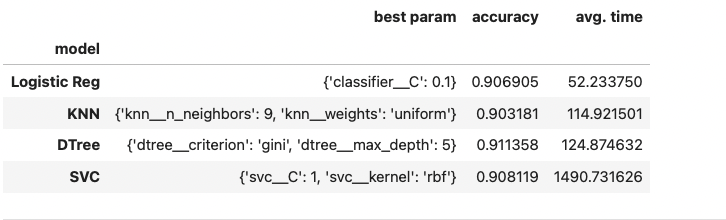
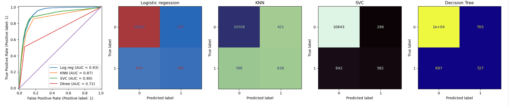

# ml-ai-comparing_classifiers

### Objective
Using the provided [data](https://archive.ics.uci.edu/dataset/222/bank+marketing), which is related with direct marketing campaigns of a Portuguese banking institution.
  
The classification goal is to identify a model to best predict if the client will subscribe a term deposit.
Utilizing modeling and performing a comparison using Logistic Regression, K-Nearest Neighbors, Decision Tree and SVM models to understand which model is the best suited to provide the most accurate data such that the banks could successfully subscribe more customers with a fewer number of calls.

### Data Understanding
After the data exploration, data preparation to cleanse or delete the data was performed so that the model could be performant.
A very few number of duplicate rows existed in the data. A large amount of features were not a domain knowledge for me so researching on for example what is euribor and consumer price index mean and whether to keep these features or not were built

### Data Preparation
The data was very mostly clean, some data had unnecessary separators with dot "." which were cleansed, columns were renamed for better representation of the actual data they are representing.
For example column='y' was renamed as 'Subscribed', and for the purpose of modeling converted to numeric values, 
0 or 1 where 1 = "yes" and 0 = "no"

Utilizing the basic histogram the data representation was performed, and it was evidently clear that in large part the data is not normalized, and would need scaling for a good model.

</img>

### Modeling
For Modeling purposes, data was encoded for the categorical columns and the numerical columns were scaled with StandardScalar.
The train split was 2/3 of the entire dataset and test split was 1/3 of the dataset. 
Upon evaluating the basic model I found that I should aim to beat 88.85% accuracy as a bottom line.

Starting with a simple Logistic Regression, the outcome was already better than expected 88.85% with all the features. However, it was important to fine tune the hyperparmeters and find out if the other models can perform better.
</img>

Then the other models were built 
1. KNN
2. Decision Tree
3. SVM

The basic models had lower accuracy scores, and high precision scores, Logistic Regression and SVM continued to provide good AUC however more fine-tuning was required to find better accuracy scores.

</img>

### Evaluation

In order to find the best hyperparmeters GridsearchCV was utilized and the outcomes were exemplary and mostly all models came out beating the baseline score of 88.85%

</img>

Even though in the base model the Decision Tree seems to be doing the best with greater than 91% accuracy, I graphed the ROC curve which showed that the AUC for Decision tree is less than 75% and for that reason Decision Tree were not evaluated to be the best model for this purpose.
For Logistic Regression the AUC is 93% which in long term will provide the most accurate predictions and so for that reason even though with an accuracy score of 90.69% Logistic Regression model is proposed solution.
</img>

## Conclusion
Headline: Logistic Regression is the winner!

The testing of different models showed that the Decision Tree classifier performs the best upon hyperparmeter tuning and with a max depth of 5 with 91.14%, however the AUC is only 72%, it does not makes the correct choice for the problem we are trying to solve.
Given the Logistic Regression is 90.69% accuracy and 93% AUC, which makes it the recommended model.
Given this model, improves upon the initial baseline performance of 88.85% and would be additive for the banks to utilize Logistic Regression.

Recommendation:
This accuracy could be further improved with experimenting removing more features and testing out the results to find even better performance model. The banks can utilize the data and use it for marketing to the right set of customers at the right time.
##### Next steps:

The recommended items which could be utilized to further improve the accuracy of the data
1. Comparing the classifiers for the top ten campaigns to see if the performance of the models increase since these have the largest samples of customers.